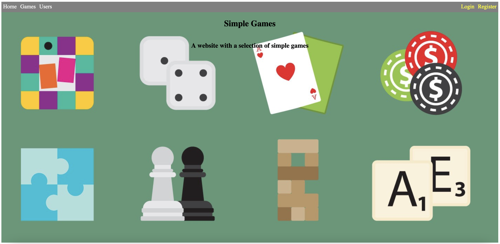
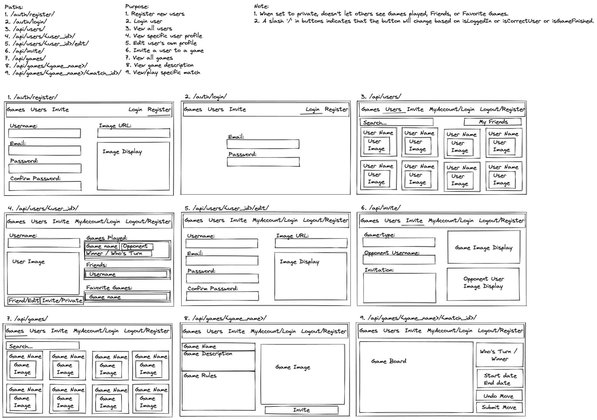
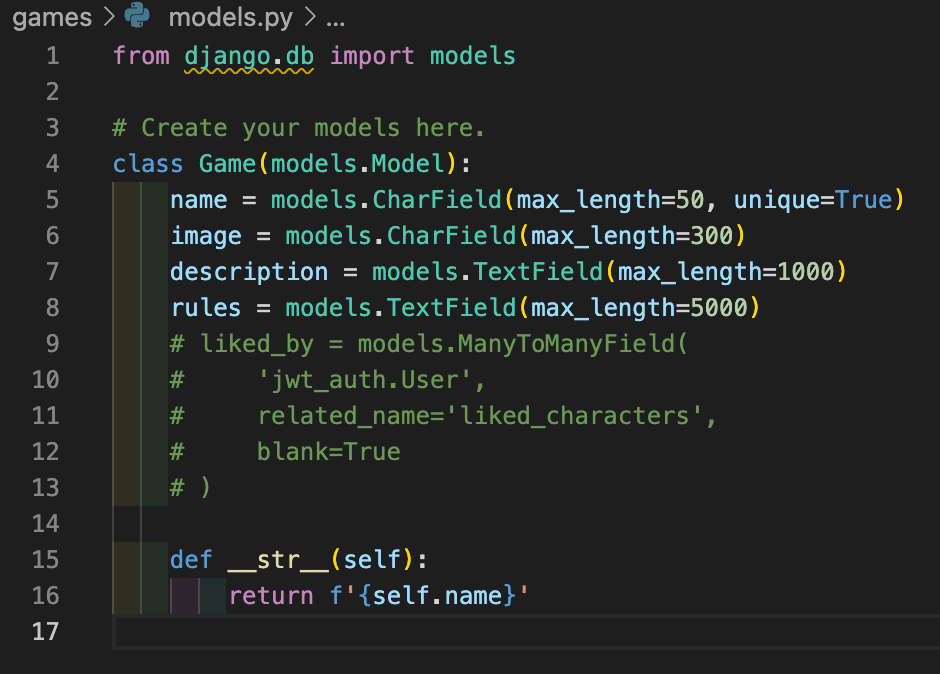
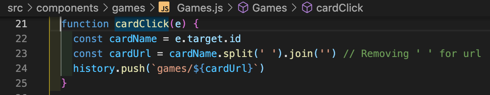
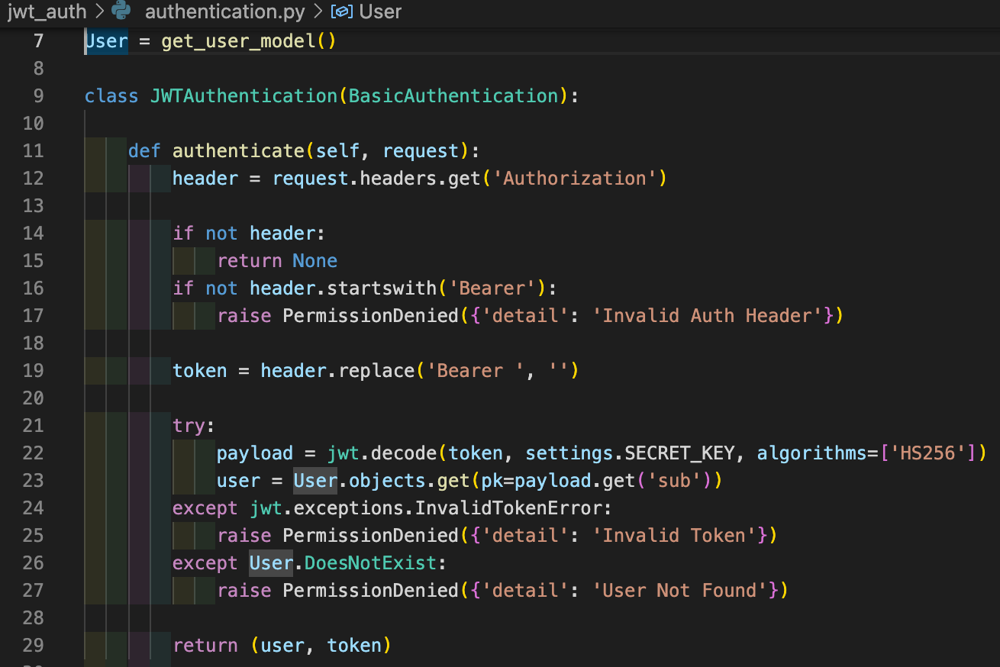
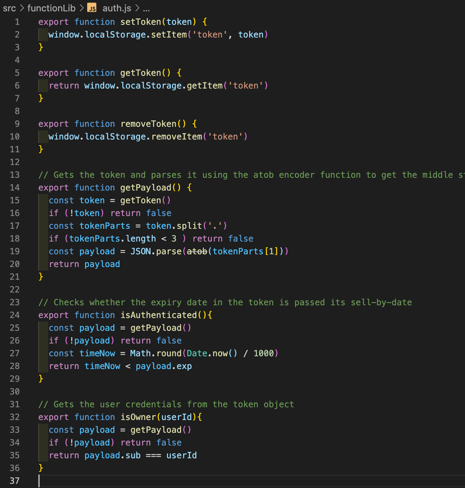
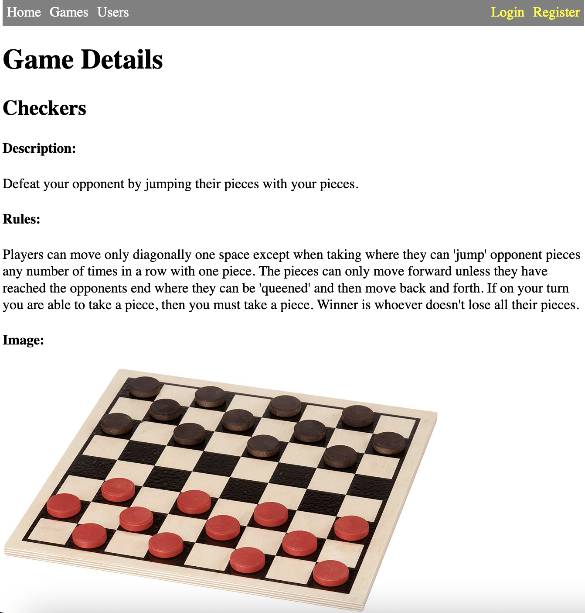
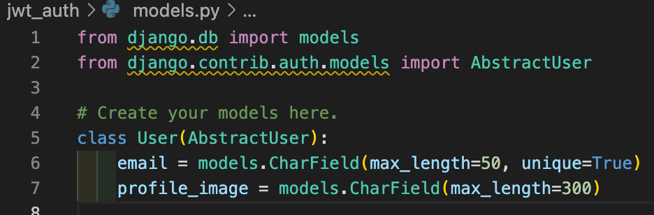

# General Assembly Project 4: Simple-Games

## Table of Contents:
1. [Overview](#overview)
1. [Brief](#brief)
1. [Planning](#planning)
1. [Approach](#approach)
1. [Wins](#wins)
1. [Challenges](#challenges)
1. [Key Learnings/Takeaways](#key-learningstakeaways)
1. [Future Features](#future-features)
1. [Bugs](#bugs)

## Overview:
My forth project in the Software Engineering Immersive Course and my first time coding the backend in a project. The project was to make a website with user accounts you can make and login to and simple games pages you can look at.

## Brief:
**Goal:** Create a website for looking at descriptions of simple games.

**Timeframe:** 1 week.

**Group size:** Solo.

**Frontend software used:** JavaScript, React, Sass.

**Backend software used:** Python, PostgreSQL, Django.

**Deployed version:** https://sei-project-four.netlify.app/

## Planning:
My initial idea was extremely overambitious with the idea of coding multiple two player games and implementing it such that two users can play it online which is a type of interactivity I had never tried before nor seen done. I was convinced by my tutors to aim for something realistic with some stretch goals for if I finish that early. The end result is that I decided to cut out the actual functioning games and replace it with informational pages and had favoriting, following, and invites as a stretch goal. Sadly, due to some issues, I ran out of time before implementing the stretch goals:

## Approach:
My approach for the frontend was to focus on main and home pages before coding the detail pages, taking the time to plan out and create all the components I thought I would need before coding them.
For the backend, I made some models first, checking things were working how I wanted before adding new features. I made the game models first before getting stuck on the user side of things for a while before eventually creating some user models too. I often coded new backend parts as and when I realised I would need them for the frontend.

I started with the backend, coding a model for the games and their descriptions. I later put some commented out work for stretch goals in advance that sadly wasn’t used in the end:

I then added a functioning GET to the backend and some seed data to test with.

I then worked on the frontend, adding the basic router boilerplate, some very basic components for each page and a basic navbar.

I then coded the specific game page and games menu page to display data from the backend and coded it such that the url of the specific game board incorporated the name of the game. I also connected the front end to the backend and improved the navbar.

I then spent a couple days trying several different methods to incorporate the base login system of the backend to use to login users in my website. Sadly none of them worked and after bringing it to my tutors it was found that it would be easier to just code my own user system in the backend, so I did.

I added authentication tokens so that you need to be logged in to get more specific data and a register system to make more users and several other systems to make it work:

I then added some user profile pages, a users menu page, login and register pages, and some authentication and api components to the frontend. I also added filters to the menu pages. The user profile and user menu pages were very similar to their games counterparts in construction. The auth and api components were very helpful in the get requests and handling the permissions for seeing user profiles and such, it also checked the making/removing tokens and checking their expiry date.

I then added seeds for both the games and users before finally adding lots of basic styling and cleaning up the code of things like console logs as I had finished the basic functionality and was close to the deadline.

## Wins:
A win was having the names of the simple games appear in the URL of the page when viewing them:

## Challenges:
A challenge was trying to use the user login system that comes with it by default and not being able to connect it to the front end properly, nor figure out why it was working. Eventually I made my own user model and used that.

## Key Learnings/Takeaways:
A key learning is to not stubbornly try to make something work for long periods of time and to get advice from senior coders quickly rather than spending days trying to figure out the problem on your own.

## Future Features:
Future features include editing user accounts,  sending invites to other users to play a simple game, and eventually coding some simple turn-based games that pairs of users can play using a system to store game moves and communicate that to other players to play a simple game between two players.

## Bugs:
If the website hasn’t been used in a while, the Games and Users menu will show up empty and you will have to refresh the page after waiting a few seconds to get it working. This bug went unnoticed during development and was only noticed after deployment.
